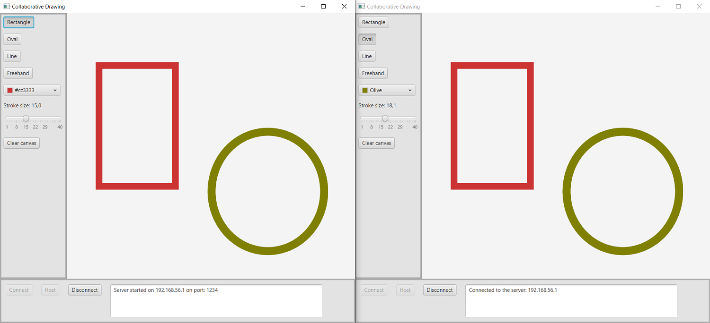

# Collaborative drawing #

Simple drawing program where multiple users can work on the same image. It's a networked application where one user starts a server to enable clients to connect to it. It utilizes reactive programing by including the RxJava library.

### Features ###
- Everyone connected can see what everyone else draws.
- New clients can connect at any time.
- Newly connected clients receives all previously drawn objects.

git